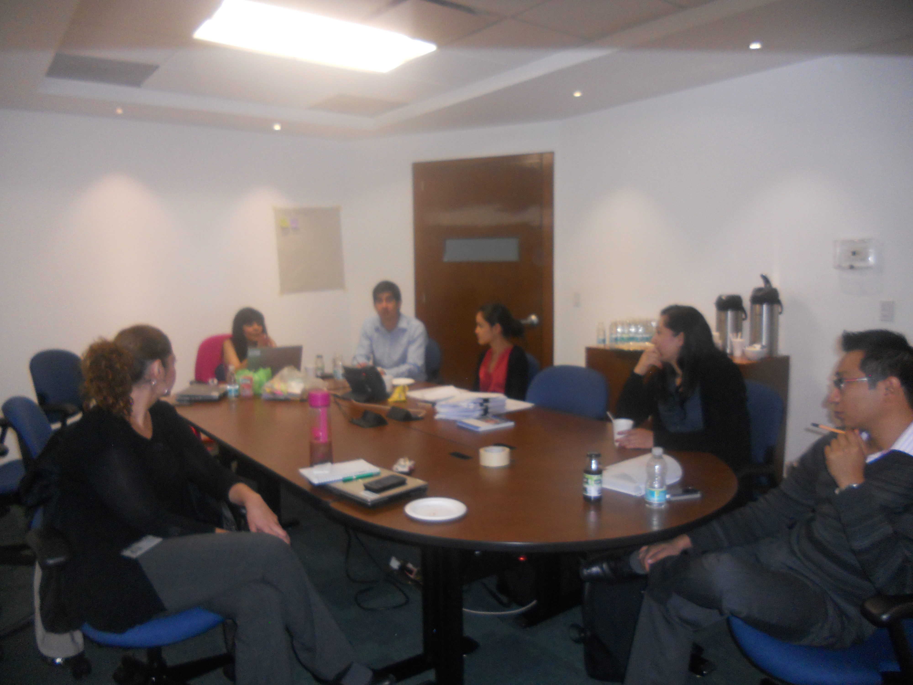
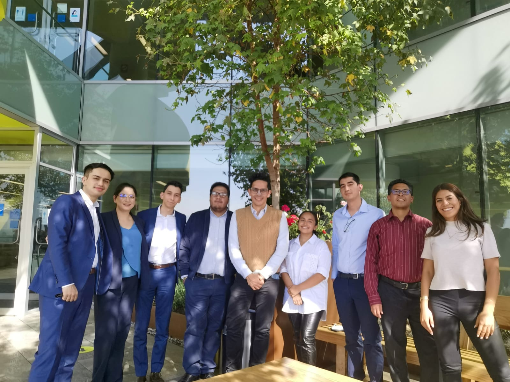

### Hi there 
This is the place where I try to learn to code :rofl:

- 🎓🏊🏻 &nbsp;Former student-athlete.
- 👨🏻‍💼 &nbsp;I'm a professional with multi-disciplinary background and 5+ years of industry and consulting experience.
- 💼 &nbsp;Experience ranges from delivering commercial strategies to helping companies in their digital transformation.
- 👨‍💻 &nbsp;I'm currently learning at MIT Xpro how to become a Full Stack Developer.

✨ &nbsp;**Some hightlights**

📕 &nbsp;**I've worked for Roche, PepsiCo and BBVA as a Transformation and Strategy Consultant**

I love projects, continuous improvement, finance and software development

  

    

    
    

  

  

    

    
    

  

  
📕 &nbsp;**Co-founder of Atletas de México**

Atletas de México is an NGO that has recognized 86 Mexican athletes and has more than 300,000 followers in Social Networks.

<!-- BLOG-POST-LIST:START -->
- [La historia de Horus Briseño](https://www.facebook.com/atletasdemexico/videos/645603152550760)
- [La historia de Amaya Velázquez](https://www.facebook.com/atletasdemexico/videos/310107599665577)
- [La historia de Francisco Sentíes](https://www.facebook.com/atletasdemexico/videos/2098798277040458)
<!-- BLOG-POST-LIST:END -->

### Want to know more?

🔗 &nbsp;**Connect with me**

